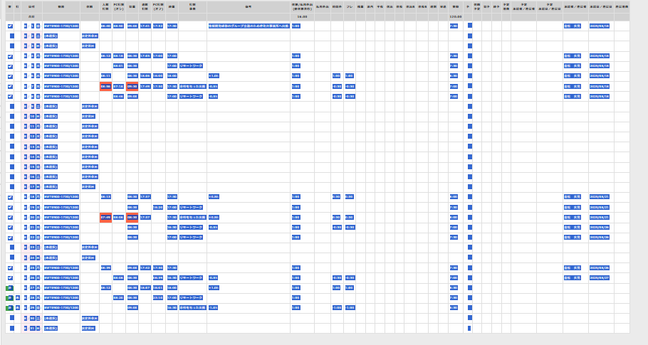

# リシテアの情報から、工数管理エクセルに入力できる形に変換するアプリ

## 手順
- リシテアの勤務日時一覧を開く
- 図のように項目をコピーする

- コピーした情報をtxtファイルにそのままペーストする
- そのテキストファイルをDifyへと入力する
- Difyが勤務開始時刻、終業時刻、勤務時間をまとめてくれる
- まとめてくれた情報をtxtファイルにコピペする
- テキストファイルのデータをコピーして、工数管理エクセルに「プレーンテキストを貼り付け」
- これで適切な業務時間が添付できる

## 注意
- 検証が足りていない部分があります
- 休暇の分の空白の数が合わないことがあります

## 試行錯誤
- 勤務時間のページのスクリーンショットやpdfでは無理であった
- エクセルに直接入力する操作は未実施（Difyでは困難だと判断）

## TODO
勤務開始時刻、勤務終了時刻がどのタイムスタンプなのかという判断が適当になっている。具体的には10の倍数かどうかで判断している。
そのため、適切な選定方法にしなければならない。
→PCloginも入館も業務開始前だからその条件分岐でいけるかも？